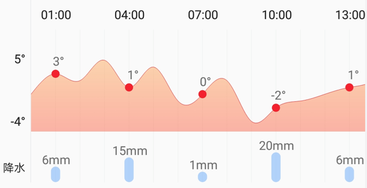
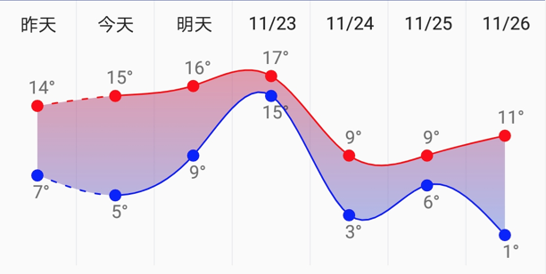
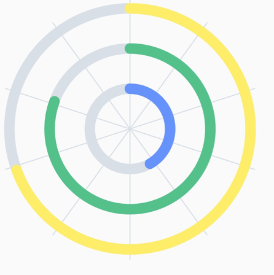

# CustomView
一周天气，二十四小时天气的曲线折线图

### DayWheatherView

记录24小时的气温及降水的曲线图,与HoursWeatherView合作完成

使用示例：

```java
DayWeatherView view = findViewById(R.id.day);
int[] temp = {0, 3, 2, 5, 1, 4, -1, 0, 2, -4, -2, -1, 0, 1, 2, 4, 1, -1, 0, -2, 0, 2, 1, -1};
int[] water = {0, 6, 4, 12, 15, 4, 2, 1, 10, 10, 20, 5, 15, 6, 2, 4, 1, 8, 0, 9, 0, 2, 1, 12};
view.setData(temp, water);
```

效果图



### WeekWeatherView

一周天气曲线图

使用：

```java
WeekWeatherView view = findViewById(R.id.weekView);
view.setTempDay(new int[]{14, 15, 16, 17, 9, 9,11});
// set night
view.setTempNight(new int[]{7, 5, 9, 15, 3, 6,1});
view.invalidate();
```

效果图



### CircleChatView

圆形进度的统计图

用法

```java
CircleChartView chartView = findViewById(R.id.chart_view);
CircleChartUtil.startAnimotor(chartView,3000,250,290,150);
```

效果图



以上自定义View均为自己项目中使用的View，暂未考虑兼容问题，如果想要在你自己的项目中使用的话，请修改代码。